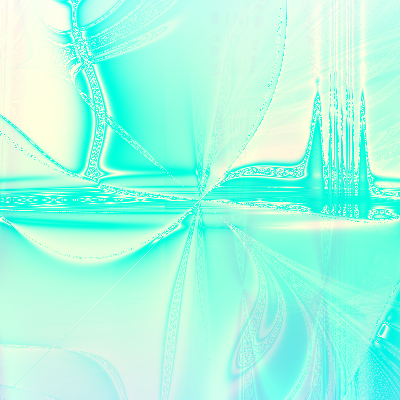

# randomart

image generated using the string: `My brain on drugs` with depth = 40\
(sadly, this cannot be made anymore because i chose multi-threaded tree gen sadface)

> currently experimenting with metal gpu. it works as of now, need to just automate the process

## generate mode
takes string and maximum depth as inputs, outputs the image and its respective formula in a txt file

## read mode
takes file name as input. no need to mention ".txt" in the name
> this reads from .txt files strictly

## references:
https://netsec.ethz.ch/publications/papers/validation.pdf

https://www.youtube.com/watch?v=3D_h2RE0o0E

## gallery(built during testing phase(not reproducible))

