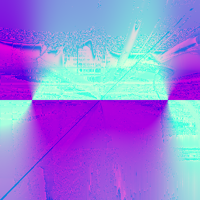

# randomart


image generated using the string:
`My brain on drugs`

## how to run:
```
cargo run "<string>" <depth> <output file name> <width in pixels>(optional) <height in pixels>(optional)
```
e.g. 
``` 
cargo run "spiderman 3" 40 spiderman 1920 1080
```

> NOTE: the width and height arguments are optional with the default values being set as 400 pixels for both

## references:
https://netsec.ethz.ch/publications/papers/validation.pdf

https://www.youtube.com/watch?v=3D_h2RE0o0E

## gallery(built during testing phase(not reproducible))



