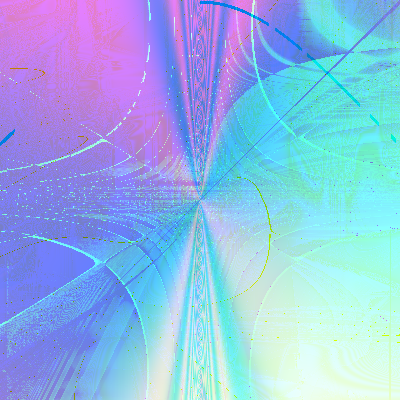
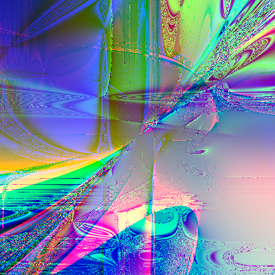
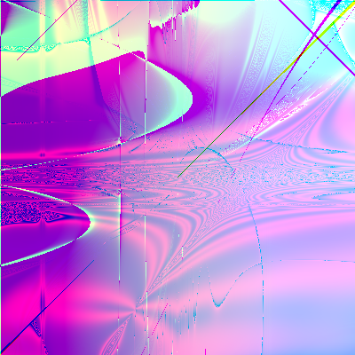
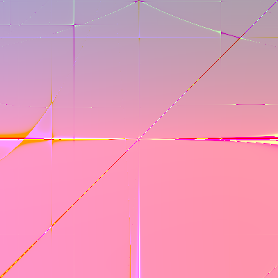
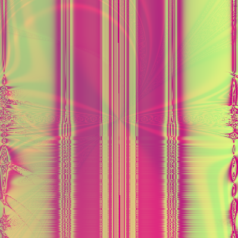
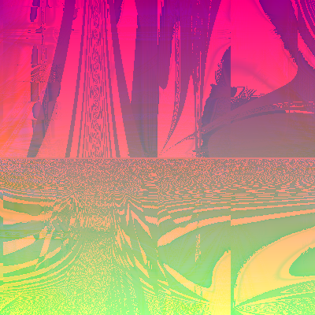
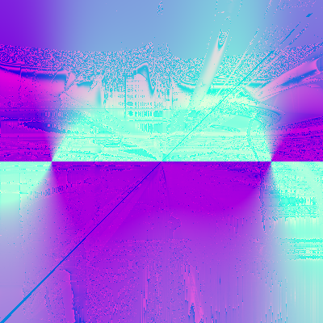
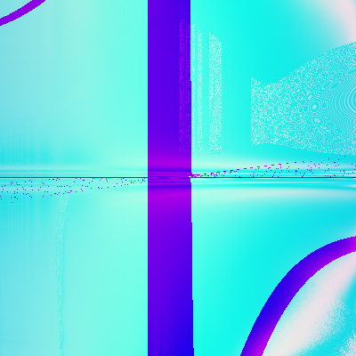

# randomart

image generated using the string: `My brain on drugs`

## references:
https://netsec.ethz.ch/publications/papers/validation.pdf

https://www.youtube.com/watch?v=3D_h2RE0o0E

## randomart_cargo
uses the cargo build system to generate output\
better performance for larger depths/height/width\
it uses a build.rs to generate a file that writes the function for each channel in a rust file\
the functions it references are stored in `randomart_cargo/src/math.rs`\
highly extendable and the preferred option for more computationally expensive generations\
only caveat is that it requires the cargo build system

## randomart_standalone
has the code for the standalone version\
this can be directly compiled into binaries\
much slower than randomart_cargo but can be used for smaller images/depths or for portability\
has two functionalities: string to image & file containing randomart spec lang to image

## gallery(built during testing phase(not reproducible))

