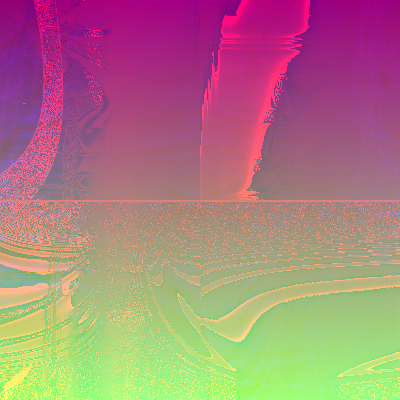

# randomart


image generated using this formula:

```
Triple(Div(Add(Number(0.686373), Sin(Cos(Mult(Y, Div(Sin(Sin(X)), Mult(Cos(Cos(Exp(Sin(Cos(Y))))), Sin(Sin(Sqrt(Div(Sqrt(Sin(Exp(Mult(Sin(Sqrt(X)), Sin(Sin(X)))))), Sin(Div(Sin(Add(Sqrt(Cos(X)), Sin(Sqrt(X)))), Exp(Sin(Div(Number(1.9274923), Div(X, Y)))))))))))))))), Exp(Div(Number(0.66636676), Mix(Mult(Mult(Sin(Mult(Mix(Mult(Number(-0.30661842), Div(Mult(Sin(Cos(Cos(Sin(Cos(X))))), Add(Number(1.7259638), Add(Sin(Sin(Mult(Y, Number(0.55249023)))), Cos(Sqrt(Sin(X)))))), Add(Sin(Mix(Sin(Mult(Mix(Number(-0.2570064), X, X, Y), Sqrt(X))), Exp(Mix(Sin(X), Sin(Y), Cos(X), Mix(Y, X, Number(-0.85492814), X))), Exp(Cos(Sin(X))), Sin(Div(Exp(Y), Add(Number(0.39193344), X))))), X))), Number(0.0), Add(Exp(Mult(Mix(Div(Sin(Sqrt(Div(Y, Y))), Cos(Exp(Sin(X)))), Cos(Div(Mix(Number(-0.9619578), Y, Mix(X, Number(0.9829658), X, X), Add(Number(0.00033164024), Y)), Div(Add(X, Number(0.37760782)), Number(0.9661764)))), Number(-0.3052044), Number(0.9594791)), Mult(Cos(Sin(Div(Cos(X), Number(0.734452)))), Cos(Cos(Y))))), Cos(X)), Mult(Add(Sqrt(Sin(Sin(Sin(Sin(Sin(X)))))), Div(Number(-0.7846104), Sin(Sin(Sqrt(Div(Add(Y, X), Number(0.38525748))))))), Cos(Sqrt(Add(Sin(Sin(Sin(Sin(Y)))), Mix(Mix(Exp(Mix(X, Number(0.6764331), Number(-0.002668023), Y)), Number(-0.6547586), Exp(X), Exp(Add(Number(0.2886889), Y))), Number(0.32251045), Number(0.6988021), Mix(Exp(Cos(Y)), Y, Add(Add(Y, X), Sin(X)), Exp(Sin(X))))))))), Add(Div(Mix(X, Div(X, Number(1.5036478)), Number(2.3197768), Exp(Div(Number(0.8855487), Sin(Sin(Y))))), Add(Mult(Mix(Sqrt(Mix(Number(2.2976186), Sqrt(Exp(Y)), X, Number(0.4626441))), Mult(Div(Number(0.5918728), Sin(Sqrt(X))), Cos(Sin(Cos(X)))), Number(-0.16642624), Number(-0.43029097)), Number(1.0)), Sin(Sin(Cos(Cos(Cos(Sin(Y)))))))), Div(Mult(Sin(Mult(Sin(Exp(Cos(Mix(X, X, Y, Number(-0.26491487))))), Number(-0.5365895))), Sin(Div(Add(Mix(Div(Number(0.99712026), Cos(X)), Sin(Cos(X)), Number(0.82052636), Cos(Mult(Y, X))), Cos(Mix(Number(0.71865386), Cos(X), Div(X, Y), Cos(Y)))), X))), Exp(Sin(Sin(Mix(Mult(Div(Sqrt(Y), Number(0.14593363)), Sqrt(Sin(X))), Cos(Cos(Mult(Number(0.17649806), X))), Mult(Number(1.4474224), Cos(Div(X, Y))), Sin(X))))))))), Cos(Sin(Exp(Cos(Mult(Cos(Add(Number(0.5938111), Add(Add(Mix(Sin(Y), Cos(Y), Cos(Y), Sin(Y)), Mult(Mix(X, X, Number(-0.8217878), Number(-0.8065264)), X)), Cos(Sin(Sin(Y)))))), Cos(Cos(Sin(Sin(Y)))))))))), Div(Cos(Y), Cos(Y))), Cos(Mult(Sin(Sqrt(Exp(Sqrt(Cos(Add(Mult(Cos(Mix(Number(-0.4547348), Y, Number(-0.40319186), Sin(Sin(Y)))), Sqrt(Exp(Sin(X)))), Cos(Sin(Div(Number(0.9831414), Add(Mult(Number(0.065757394), Y), Sqrt(X))))))))))), Cos(Cos(Mult(Cos(Mult(Sin(Cos(Div(Cos(Sin(Mult(X, X))), Cos(Mult(Cos(X), Cos(X)))))), Cos(Cos(Cos(Y))))), Exp(Cos(Sqrt(Cos(Mult(Sin(Mult(Number(0.7682919), Mix(X, Y, Y, X))), Sqrt(Mult(Cos(Y), Div(Y, X))))))))))))), Cos(Add(Sin(Cos(Sin(Add(Mult(Exp(X), Sqrt(Exp(Mult(Exp(Mult(Number(-0.5449238), Sin(Y))), Add(Cos(Add(Y, Y)), Number(0.9877779)))))), Div(Add(Cos(Cos(Div(Sin(X), Number(0.56520534)))), Sin(Cos(Sin(Sin(X))))), Add(Cos(Cos(Sin(Exp(Cos(Y))))), Cos(Add(Sin(Add(Sqrt(X), Div(Y, X))), Sqrt(Sin(X)))))))))), Sqrt(Sqrt(Add(Add(Sin(Cos(Sin(Exp(Cos(Mult(Cos(Y), Add(Y, Number(0.20476437)))))))), Cos(Sin(Cos(Y)))), Cos(Mix(Div(Cos(Mult(Sin(Add(Sin(Y), Number(-0.15239131))), Add(Div(Mult(X, Number(-0.4414025)), Mix(Number(-0.9442846), Y, Y, X)), Number(0.626438)))), Cos(Add(Sin(Cos(Sin(X))), Div(Exp(Sin(X)), Exp(Cos(X)))))), Sin(Div(Number(0.62612355), Div(Sin(Cos(Mult(X, Y))), X))), Exp(Exp(Sin(Mult(Number(0.93529534), Div(Number(0.7258456), Cos(X)))))), Cos(Sqrt(Div(Sqrt(Add(Sin(X), Number(0.94231874))), Number(0.78723365))))))))))), Sin(Sin(Mix(X, Sin(Mix(Exp(Sqrt(Mix(Mix(Number(-0.31983367), Sin(Sin(Mult(Add(Y, Number(-0.045727193)), Number(1.3438499)))), Sin(Cos(Exp(Add(Number(0.4138062), Y)))), Cos(Mix(Add(Cos(X), Sqrt(Y)), Number(0.954729), Add(Cos(X), Number(0.9638883)), Number(0.66356707)))), Number(1.0), Cos(Cos(Cos(Sin(Div(Y, Number(-0.114050984)))))), Sin(Y)))), Add(Cos(Mix(Sin(Cos(Mix(Cos(Mult(Y, Y)), Mix(Cos(Y), X, Number(0.0), Sqrt(Y)), Exp(Add(Y, X)), Mult(Add(Y, X), Add(Number(-0.3215127), Y))))), Number(0.24276114), Number(1.8444908), Cos(Sin(Cos(Cos(Exp(X))))))), Mult(Mult(Number(0.6831446), Mult(Cos(Div(Sqrt(Div(Y, Number(-0.64992726))), Number(0.6362108))), Sin(Sqrt(Exp(Add(X, Y)))))), Sqrt(Y))), Cos(Sin(Div(Mult(Mult(Cos(Add(Add(Number(-0.62430465), Y), Number(0.31052673))), Cos(Sqrt(Sin(Y)))), Number(0.5471102)), Sin(Mix(Number(-0.34060538), Mix(Number(1.0), Div(Sin(X), Number(0.7651147)), Sin(X), Sin(Mix(Number(-0.32548696), X, Y, Y))), X, Cos(Add(Cos(Y), Y))))))), Sqrt(Cos(Sin(Add(Mult(Cos(Mult(Sin(Y), Sin(Y))), Sin(Exp(Cos(Y)))), Cos(Mix(Cos(Mult(X, Y)), Cos(Cos(Y)), Mix(X, Y, Number(2.5962331), Number(0.9927783)), Y)))))))), Sin(Cos(Cos(Sin(Add(Number(0.42711392), Mix(Sin(Add(Mix(Add(Number(0.9994931), Y), Div(X, Y), Number(0.5566709), Sin(Y)), Number(-0.531147))), Mult(Exp(Mult(Add(Number(0.92121184), X), Number(0.5639292))), Cos(Div(Sin(Y), Number(0.0)))), Sin(Sin(Div(Sin(X), Sin(X)))), Sqrt(Mult(Sqrt(Mult(X, Number(0.04581046))), Add(Y, Y))))))))), Cos(Cos(Sin(Mix(Div(Add(Cos(Exp(Sin(Add(Y, X)))), Cos(Mult(Mix(Sin(Y), Exp(X), Cos(Y), Div(Number(0.8831701), Y)), Sin(Sin(X))))), X), Number(-0.41597492), Number(0.6103312), Add(Exp(Cos(Exp(Div(Mix(Number(0.18548024), Number(-0.04697287), X, Number(0.06729615)), Sqrt(X))))), Mix(Mix(Sin(Sin(Cos(X))), Mult(Sqrt(Mult(X, Number(0.8523488))), Exp(Mult(Y, Y))), Mix(Add(X, Cos(X)), Sin(Div(Y, Number(-0.0379979))), Cos(Cos(X)), Number(0.62191516)), Cos(Cos(Exp(X)))), Mix(Cos(Sin(Div(X, X))), Sqrt(Y), Cos(Exp(Cos(X))), Cos(Div(X, Number(-0.17966276)))), Number(0.3328343), Cos(Sin(Cos(Cos(Y))))))))))))))))),
Y,
Mult(Cos(Sqrt(Mix(Sin(Cos(Sin(Cos(Mix(Sin(Sin(Cos(Sin(Cos(Exp(Cos(Cos(X)))))))), Exp(Cos(Sin(Cos(Sin(Sqrt(Mult(Add(X, Y), Cos(Y)))))))), Cos(Cos(Sqrt(Add(Mult(Sqrt(Sin(Y)), Exp(Mult(Number(-0.6369897), Add(Y, Y)))), Mix(Sin(Mult(Add(Number(-0.35400218), Y), Exp(Y))), Div(Div(Cos(X), Mult(X, X)), Mult(Cos(Y), Add(Y, Number(0.6860547)))), Sin(Sin(Sin(Y))), Cos(Cos(Mult(Number(0.6749203), Y)))))))), Sin(Cos(Sqrt(Add(X, Mix(Sin(Add(Sqrt(X), Exp(Y))), Number(0.27389026), Sin(Add(Add(Y, Y), Mix(Number(0.60576737), X, X, Number(-0.8773289)))), Sqrt(Mix(Sin(Y), Number(-0.07104665), Sin(X), Add(Number(0.40966177), Y))))))))))))), Number(-0.6661038), Cos(Sin(Sqrt(Sin(Cos(X))))), Sin(Cos(Cos(X)))))), Mix(Mult(Y, Mult(Cos(Add(Exp(Mult(Mix(Add(Sqrt(Mult(Cos(Mult(Number(-0.1689261), Mult(Add(Number(0.57095814), Exp(Y)), Sin(Mult(X, X))))), Number(0.9294585))), Mult(Number(0.6222092), Cos(Add(Sin(Cos(Cos(Cos(Y)))), Sqrt(Cos(Cos(Sin(X)))))))), Mix(Mult(Cos(Sqrt(Cos(Cos(Sin(Cos(X)))))), Number(0.8163129)), Mix(Number(-0.88410664), Mix(Sin(Add(Mix(Sqrt(Sin(Y)), Mix(Sin(X), Sin(Y), Cos(Y), Cos(X)), Number(-0.1332128), Number(0.9111733)), Cos(Mix(Number(0.7230706), Sin(Y), Sqrt(Y), Number(0.0))))), Cos(Sqrt(Cos(Sqrt(Sin(X))))), Cos(Sqrt(Cos(Sin(Add(Number(-0.12995744), X))))), Div(Cos(Cos(Sqrt(Cos(X)))), Sqrt(Sin(Mix(Number(0.6077965), Sin(Y), Sin(Y), Cos(Y)))))), Y, Exp(Cos(Cos(Div(Number(0.99836236), Exp(Sin(Y))))))), Add(Exp(Cos(Exp(Sqrt(Exp(Sin(Y)))))), Cos(Mix(Sin(Sin(Sin(Mix(Number(0.750396), Y, Number(0.7005997), X)))), Mult(Sin(Mult(Cos(X), Number(1.3741046))), Cos(X)), Number(3.7642496), Sin(Add(Mix(Sqrt(Y), Y, Number(0.99103457), Mult(X, Number(0.30471373))), Cos(Div(Number(-0.5521328), X))))))), Mix(Sin(Sin(Sqrt(Mix(Cos(Exp(Y)), Add(Cos(Y), Mult(Y, X)), Number(0.82563126), Sin(Cos(Y)))))), Sqrt(Cos(Mix(Cos(Cos(Cos(Y))), Sin(Mix(Add(X, X), Mult(Number(0.08909309), Y), Add(X, Number(0.5878979)), Add(X, Number(-0.106450975)))), Cos(Mult(Number(0.4321984), Sin(X))), Div(Div(Number(0.3731032), Cos(Y)), Cos(Add(X, Number(-0.4566828))))))), Number(0.7473871), Exp(Cos(Cos(Mix(Sin(Mult(Y, Number(-0.59669995))), Exp(Exp(Y)), Sqrt(Div(Number(-0.6026432), Y)), Number(2.0762398))))))), Number(0.77125), Cos(Div(Cos(Cos(Mix(X, Sin(Y), Cos(Exp(Exp(X))), Div(Y, Cos(Mult(Y, Number(-0.6366973))))))), Sin(Sin(Mix(Cos(Y), Div(Mult(Number(-0.06447513), Sin(X)), Cos(Add(Number(0.34597528), Y))), Cos(Cos(Sin(Y))), Mix(Add(Mult(Number(-0.8950111), Y), Sin(X)), Y, Number(0.7384033), Sin(Cos(Y))))))))), Div(Cos(Cos(Cos(Cos(Sin(Mult(Cos(Sin(Y)), Number(0.9570308))))))), Mix(Number(0.73548687), Cos(Exp(Sqrt(Sin(Sin(Cos(Cos(Y))))))), Cos(Cos(Mult(Mix(Mix(Cos(Sin(X)), Mult(Number(0.7881724), Div(Y, X)), Mult(Add(Number(0.88850343), Y), Sin(Y)), Number(0.46189368)), Cos(Cos(Cos(X))), Sin(Cos(Mix(Y, X, Number(0.2969669), Number(0.6180321)))), Number(2.4392288)), Sin(Div(Mix(Mix(Y, Y, X, Y), Mult(X, Number(0.38502717)), Number(0.068482995), Mult(Number(-0.5732194), Y)), Sin(Div(Number(-0.0726378), X))))))), Number(0.37466112))))), Sin(Mix(Cos(Cos(Sin(Sqrt(Y)))), Mult(Sqrt(Mult(Mult(Sin(Add(Number(0.31789392), Cos(Y))), Cos(Y)), Cos(Cos(Mix(Cos(Cos(Mix(X, Y, Y, Number(-0.50199676)))), Cos(Div(Sin(Y), Cos(X))), Mult(Sin(Div(Y, X)), Exp(Cos(Y))), X))))), Cos(Mix(Sin(Cos(Sqrt(Sin(Mix(Div(X, Number(-0.33304155)), Number(1.2541634), Add(X, X), X))))), Sin(Div(Cos(Cos(Sin(Sin(Y)))), Sin(Exp(Add(X, Cos(X)))))), Div(Mult(Sqrt(Mix(Y, Number(0.7775856), Number(0.63480806), Cos(Cos(Y)))), Cos(X)), Sin(Mult(Sin(Mult(Mult(Number(0.53478885), Y), Add(Number(-0.5477965), Y))), Sin(Cos(Cos(X)))))), Number(0.7084506)))), Cos(Sqrt(Add(Sin(Sin(Y)), Exp(X)))), Add(Exp(Exp(Add(Sqrt(Sin(Cos(Mult(Number(2.4306185), Mult(X, Number(0.91461563)))))), X))), Exp(Sin(Mix(Div(Exp(Mult(Sqrt(Add(Y, Number(-0.8905563))), Mult(Add(X, Y), Number(2.1007419)))), Sin(Sqrt(Sin(Div(Y, Y))))), Cos(Sqrt(Y)), Exp(X), Number(0.5948379))))))))), Sin(Cos(Mult(Mult(Number(0.68916434), Add(Cos(Cos(Mult(Sqrt(Cos(Sin(Mult(Cos(Y), X)))), Mix(Cos(Exp(Mult(Cos(X), Cos(Y)))), Mix(Div(Cos(Mix(Y, Y, Number(-0.3753299), X)), Number(0.79341084)), Number(0.4550675), Div(Cos(Exp(X)), Number(-0.09867754)), Mix(Exp(Exp(X)), Add(Cos(X), Cos(X)), Number(-0.28537047), Div(Sin(Y), Number(0.32361194)))), Cos(Add(Add(Mix(Y, X, Y, X), Sqrt(X)), Exp(Mix(Number(-0.79582965), Number(0.03277147), Y, Number(0.7603396))))), Sqrt(Div(X, Mult(Sin(Y), Sin(X)))))))), Sin(Cos(Div(Cos(Sin(Cos(Add(Cos(X), Number(0.43573272))))), Sin(Div(Mix(Number(2.713658), Mix(Exp(Y), Exp(X), Sin(X), Mult(X, X)), Mix(Sqrt(X), Number(-0.32041034), Sin(Y), Cos(Y)), Cos(X)), Mult(Cos(Exp(X)), Mult(Sin(Y), Cos(Y)))))))))), Exp(Cos(Mult(Mult(Sin(Mult(Add(Div(Add(Add(X, Number(-0.013236105)), Sqrt(Y)), Y), Sin(Mix(Sin(X), Add(X, X), Number(0.47213364), Div(Y, X)))), Mult(Mult(Sin(Sin(X)), Cos(Sin(X))), Number(0.9991281)))), Cos(Div(Div(Sin(X), Sin(Cos(Sin(X)))), Cos(X)))), Sin(Sin(Exp(Mix(Mult(Mix(Cos(X), Number(2.333165), Div(X, Number(0.901212)), Number(0.9453289)), Div(Sin(Y), Number(0.9611327))), Div(Number(0.65304524), Sqrt(Div(Y, Number(0.17022884)))), Sqrt(Div(Sin(X), Cos(X))), Sin(Cos(Div(X, Y))))))))))))))), Sin(Sin(Y)), Number(1.9812315), Cos(Exp(Sqrt(Mix(Add(Sin(Sin(Div(Mult(Mix(Sin(Sin(Div(Number(0.6139124), Cos(Sin(Y))))), Cos(Cos(Div(Number(0.7576096), Mix(Number(0.0), Number(2.0408168), Mult(X, X), Cos(X))))), Sin(Div(Sin(Y), Sin(Div(Cos(X), Cos(X))))), Sin(Add(Cos(Cos(Cos(Y))), Exp(Sin(Mult(Number(-0.5917237), X)))))), Cos(Cos(Sin(Y)))), Mix(Cos(Y), Sqrt(Mult(Cos(Cos(Sqrt(Cos(X)))), Cos(Sqrt(Cos(Add(X, Number(0.6104591))))))), Div(Cos(Div(Sin(X), Add(Div(Cos(Y), Sin(X)), Sin(Mult(X, Y))))), Mix(Mult(Mix(Number(0.52034104), Mix(Sin(X), Cos(Y), Number(0.97382414), Add(Number(0.582808), Y)), Mult(Cos(X), Cos(Y)), Sin(Sqrt(X))), Sqrt(Exp(Y))), Div(Cos(Y), Exp(X)), Add(Mix(Sin(Sin(X)), Div(Number(0.20069425), Add(X, Y)), Add(Exp(Y), Exp(Y)), Y), Cos(Sin(Cos(Y)))), Mult(Mix(Sin(Sin(X)), Add(Add(Number(0.79266167), X), Number(-0.16753438)), Cos(X), Add(Exp(X), Sqrt(X))), Sin(Sin(Cos(X)))))), Cos(Sin(Sin(Cos(Div(Y, Div(Y, X)))))))))), Add(Cos(Cos(Sin(Sin(Div(Cos(Sin(Add(Mix(Y, Number(0.45666337), X, X), Number(0.5290232)))), Mix(Number(0.9790369), Sin(Sin(Cos(Y))), Div(Add(Sin(X), Cos(Y)), Cos(Sin(Y))), Cos(Div(Cos(Y), Cos(Y))))))))), Mult(Sqrt(Add(Sin(Cos(Div(Div(Cos(Mix(X, X, Y, X)), Cos(Sqrt(X))), Mix(Cos(Mult(Number(-0.38597637), Y)), Mult(Div(Y, X), Mult(X, Number(-0.5198046))), Div(Number(0.051579107), Mult(X, X)), Sin(Sin(X)))))), Cos(Mult(Cos(X), X)))), Sqrt(Sin(Div(Add(Number(0.19756238), Mix(Cos(Mult(Number(0.69373924), Cos(X))), X, X, X)), Y)))))), Cos(Sin(Sin(Sin(Sin(Exp(Mult(Mix(Mix(Number(0.87724173), Add(Cos(X), Exp(Y)), Mult(Cos(X), Sin(Y)), Add(Number(-0.15472381), Cos(X))), Div(X, Add(X, Mult(X, Number(0.23911572)))), Exp(Mult(Number(-0.55614614), Mix(X, X, Number(0.08039367), Number(0.5718888)))), Sin(Add(Number(0.9864645), Add(X, Y)))), Exp(Cos(X))))))))), Sin(Div(Exp(Cos(Sin(Sin(Sin(Mult(Number(0.5985373), Div(Div(Sin(X), Mult(X, Number(0.10399163))), Y))))))), Cos(Sin(Div(Number(0.8296132), Cos(Div(Mult(Sin(Cos(Sin(Y))), Add(Mix(Cos(Y), Sin(X), Mix(Y, Number(-0.86337614), X, Number(-0.09413463)), Y), Add(Number(-0.64523846), Sin(Y)))), Mult(Cos(Sin(X)), Div(Cos(Cos(X)), Mult(Cos(Y), Number(0.9194191))))))))))), Add(Mult(Y, Y), Sqrt(Div(Cos(Cos(Div(Exp(Cos(Sin(Mult(Mix(Y, X, Y, Y), Add(X, Number(0.763054)))))), Mix(Sin(Mix(Exp(Mix(Number(-0.92663693), Number(0.07739127), Y, Number(-0.59588516))), Div(Mix(Number(-0.7822008), Y, Number(-0.7499936), Number(-0.4514976)), Mult(X, X)), Mix(Div(Number(-0.5781597), X), Add(Number(-0.9275126), X), Sin(Y), Number(0.9757564)), Sin(Sin(X)))), Exp(Sin(Mix(Sin(Y), Cos(Y), Number(0.9996711), Div(Y, X)))), Cos(Cos(Exp(Cos(Y)))), Mix(Cos(Mult(Mix(X, Number(0.6559305), X, Y), Sqrt(Y))), Sin(Cos(Cos(X))), Exp(Cos(Sin(Y))), Number(0.37571147)))))), Cos(Sqrt(Cos(Cos(Cos(Mult(Y, Cos(Cos(X))))))))))))))))))
```

## how to run:
```
cargo run "<string>" <depth> <output file name> <width in pixels>(optional) <height in pixels>(optional)
```
e.g. 
``` 
cargo run "spiderman 3" 40 spiderman 1920 1080
```

> NOTE: the width and height arguments are optional with the default values being set as 400 pixels for both

## references:
https://netsec.ethz.ch/publications/papers/validation.pdf

https://www.youtube.com/watch?v=3D_h2RE0o0E

## gallery(built during testing phase(not reproducible))


